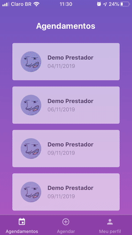
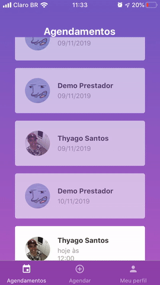

# GoBarber - Mobile

:scissors: A React Native App that allows users to schedule appointments with their favorite barber

### Demo





## :rocket: Technologies

This project was developed with the following technologies:

- [Expo](https://docs.expo.io/versions/latest/)
- [React Native](http://facebook.github.io/react-native/)
- [babel-plugin-root-import](https://github.com/entwicklerstube/babel-plugin-root-import)
- [react-navigation](https://reactnavigation.org/)
- [react-native-gesture-handler](https://github.com/kmagiera/react-native-gesture-handler)
- [Redux](https://redux.js.org/)
- [Redux-Saga](https://redux-saga.js.org/)
- [redux-persist](https://github.com/rt2zz/redux-persist)
- [styled-components](https://www.styled-components.com/)
- [Axios](https://github.com/axios/axios)
- [Immer](https://github.com/immerjs/immer)
- [date-fns](https://date-fns.org/)
- [react-native-linear-gradient](https://github.com/react-native-community/react-native-linear-gradient)
- [react-native-vector-icons](https://github.com/oblador/react-native-vector-icons)
- [react-native-vector-icons](https://github.com/oblador/react-native-vector-icons)
- [Reactotron](https://infinite.red/reactotron)
- [reactotron-redux](https://github.com/infinitered/reactotron-redux)
- [reactotron-redux-saga](https://github.com/infinitered/reactotron-redux-sagan)
- VS Code with EditorConfig and ESLint

## :information_source: How To Use

```bash
# Install expo
$ download and install expo app on smartphone

# Clone this repository
$ git clone https://github.com/thyagoaraujo/gobarber-mobile.git

# Go into the repository
$ cd gobarber-mobile

# Install dependencies
$ yarn install

# Run the app
$ yarn start
$ run expo on smartphone
```

## :memo: License

This project is under the MIT license. See the [LICENSE](https://github.com/thyagoaraujo/gobarber-mobile/blob/master/LICENSE.md) for more information.

---

## Version Web and API

https://github.com/thyagoaraujo/gobarber-frontend

https://github.com/thyagoaraujo/gobarber

Made with ♥ by Thyago Araujo :wave: [Get in touch!](https://www.linkedin.com/in/thyagosantosaraujo/)
